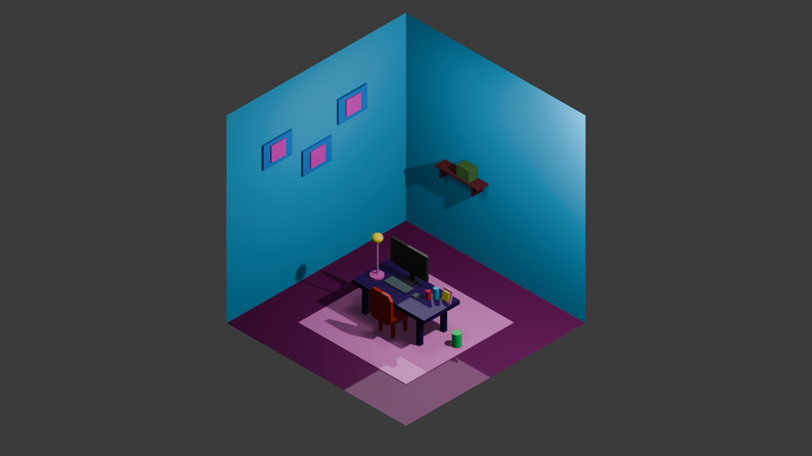

# 🖥️ 3D Study Room Scene – Blender Project

## 🎨 Project Overview

This repository showcases a **stylized 3D study room scene** created using Blender.
The project focuses on **minimalist interior design, lighting composition, and low-poly modeling techniques**.

It represents a compact and functional workspace with a clean and modern aesthetic.

---

## 🖼️ Render Preview

---

## 🧱 Scene Composition

The scene includes:

* 🪑 Desk setup (table, chair, monitor)
* 💡 Desk lamp with focused lighting
* 📚 Decorative objects (books, accessories)
* 🪟 Minimal wall frames
* 🧱 Clean wall and floor geometry
* 🧩 Floating shelf with objects

---

## 💡 Lighting & Design

* Soft ambient lighting for overall balance
* Directional light creating **depth and shadows**
* Emphasis on **contrast between warm and cool tones**
* Stylized color palette (purple floor, teal walls)

---

## 🛠️ Technical Details

* **Software:** Blender
* **Render Engine:** (Cycles / Eevee – specify if needed)
* **Modeling Style:** Low-poly / Stylized
* **File Format:** `.blend`
* **Textures:** Minimal / flat materials

---

## 🎯 Key Features

* Clean and readable geometry
* Balanced composition
* Beginner-friendly modeling approach
* Suitable for **portfolio and learning purposes**

---

## 🚀 How to Use

1. Clone the repository
2. Open the `.blend` file in Blender
3. Adjust camera or lighting if needed
4. Render using your preferred engine

---

## 📚 Learning Goals

This project demonstrates:

* Basic 3D modeling
* Scene organization
* Lighting fundamentals
* Color harmony in digital environments

---

## 👩‍🎓 Author

**Beyza Karakaya**
Industrial Engineering Student
Interested in design, visualization, and digital creativity

---

## 📌 Notes

* This is a conceptual scene for practice and presentation
* Not intended for photorealistic rendering
* Can be extended with animation or advanced materials

---

✨ *“Design is not just how it looks, but how it feels in space.”*

## AI USAGE 
when this file and project are being prepared, ChatGPT, Gemini Pro and Claude versions are used. 